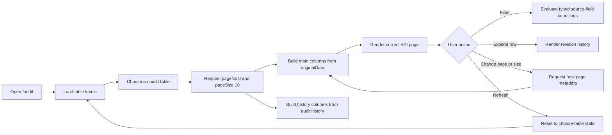

# Audit Frontend

Audit Frontend is an Angular 21 feature for exploring current records and their revision history across tables whose schemas are not identical. A user first chooses an audit table, then the page loads that table's paginated response, creates its columns from JSON, provides source-field filtering, and expands individual rows to show their audit history.

The implementation uses only the dependencies already declared in this project.

## Current capabilities

- Searchable audit-table selector loaded from JSON.
- Empty initial state; records are never fetched before a table is selected.
- Refresh resets the selected table, records, filters, expansion, and pagination.
- Table-specific JSON sources for Holiday Calendar, Loco Singapore, and Position Balance.
- Main columns generated from originalData.
- Sortable main headers with ascending, descending, and unsorted states.
- Expanded audit-history columns generated independently from auditHistory.
- Current and audit-only record states.
- Typed condition builder with AND/OR matching.
- Filter fields restricted to ID and displayed source-table columns.
- Text, numeric, date, boolean, empty, and non-empty comparisons.
- Filters applied to the records on the current API page.
- Dynamic pageNo, pageSize, totalElements, totalPages, and navigation controls.
- Keyboard-operable table search with Arrow keys, Enter, and Escape.
- Loading, empty, success, and error states.
- Responsive dark audit-console design.
- Unit and interaction tests using Angular's Vitest runner.

## User flow



## Quick start

### Tested environment

- Node.js 22.23.1
- npm 10.9.8
- Angular CLI 21.2.x

### Install and run

```bash
npm ci
npm start
```

Open http://localhost:4200/audit.

### Quality checks

```bash
npm test -- --watch=false
npm run build
```

The current baseline is 16 passing tests and a warning-free production build.

## Routes

| Route             | Purpose                                     |
| ----------------- | ------------------------------------------- |
| /audit            | Primary dynamic audit-table experience      |
| /audit/cards      | Earlier audit-card reference implementation |
| /                 | Redirects to /audit                         |
| Any unknown route | Redirects to /audit                         |

## Feature structure

```text
src/app/features/audit/
├── audit.routes.ts
├── models/
│   ├── audit-record.model.ts
│   ├── audit-table-label.model.ts
│   └── audit-view.model.ts
├── pages/
│   ├── audit-list/
│   └── audit-view/
│       ├── audit-view.ts
│       ├── audit-view.html
│       ├── audit-view.css
│       └── audit-view.spec.ts
└── services/
    ├── audit.service.ts
    └── audit.service.spec.ts

public/data/
├── audit-table-labels.json
├── audit-records.json
├── audit-records-holiday-calendar.json
└── audit-records-loco-singapore.json
```

## JSON source mapping

| Selector label   | Source file                                     | Example records |
| ---------------- | ----------------------------------------------- | --------------: |
| Holiday Calendar | public/data/audit-records-holiday-calendar.json |               1 |
| Loco Singapore   | public/data/audit-records-loco-singapore.json   |               3 |
| Position Balance | public/data/audit-records.json                  |               2 |
| Selector options | public/data/audit-table-labels.json             |        3 labels |

See [Data contracts](docs/DATA-CONTRACTS.md) for the envelope, field matrix, and rules for adding another table.

## How dynamic schemas work

The component does not contain a fixed business-record interface. It keeps only the common audit envelope strongly typed:

- Pagination metadata.
- Record identity and originalRecordPresent.
- changeSummary.
- auditHistory metadata such as operation and revision.

Business fields remain a dynamic key/value map. Main-table columns are the ordered union of allowed keys found in originalData. History columns are the ordered union of keys found in auditHistory after audit metadata is removed.

This separation is intentional: a history-only field can be displayed inside the expanded history table but cannot leak into the main table or Filter Field selector.

## Filtering behavior

Opening Filter records creates one empty condition. Each condition contains:

1. A source field.
2. A type-appropriate operator.
3. A value when the operator requires one.

The Match control supports:

- All conditions (AND)
- Any condition (OR)

Available operator groups:

| Type    | Operators                                                                                          |
| ------- | -------------------------------------------------------------------------------------------------- |
| Text    | Contains, does not contain, equals, does not equal, starts with, ends with, is empty, is not empty |
| Number  | Equals, does not equal, greater/less than, greater/less than or equal, is empty, is not empty      |
| Date    | On, before, after, is empty, is not empty                                                          |
| Boolean | Equals, does not equal, is empty, is not empty                                                     |

Incomplete conditions are ignored. Zero complete conditions display all records on the current page.

## Pagination behavior

The service method accepts tableLabel, pageNo, and pageSize and sends pageNo/pageSize as query parameters. The component synchronizes its visible state from every response.

- Selecting a table starts at page 0.
- Changing page size returns to page 0.
- First, previous, next, and last buttons calculate a zero-based target page.
- The displayed range is pageNo × pageSize + 1 through the last element on that page, capped by totalElements.

The bundled data files are static fixtures. The service adapter slices their rows and creates consistent page metadata locally so page-size behavior remains functional. A real endpoint should use the same request parameters and return the requested page metadata and rows; remove the fixture adapter when that endpoint is connected.

## Adding another audit table

1. Add the label to public/data/audit-table-labels.json.
2. Add a file named public/data/audit-records-{normalized-label}.json.
3. Use the common response envelope documented in docs/DATA-CONTRACTS.md.
4. Put current source fields inside originalData.
5. Put revision snapshots inside auditHistory.
6. Run tests and the production build.

The service normalizes labels by lowercasing them and replacing non-alphanumeric groups with hyphens. Position Balance intentionally maps to the original audit-records.json file.

## Dependency policy

No new UI library is required. The feature uses Angular standalone components, HttpClient, Router, RxJS, native HTML controls, component CSS, Tailwind's global CSS import, and the existing Angular test stack.

See [Dependency audit](docs/DEPENDENCIES.md) for installed versions, actual usage, and cleanup recommendations.

## Documentation

- [Product requirements document](docs/PRD.md)
- [Architecture and data flow](docs/ARCHITECTURE.md)
- [UI and interaction specification](docs/UI-UX-SPEC.md)
- [Data contracts and JSON catalog](docs/DATA-CONTRACTS.md)
- [Dependency audit](docs/DEPENDENCIES.md)
- [Reusable implementation prompt](docs/BUILD-PROMPT.md)

## Important implementation files

- src/app/features/audit/pages/audit-view/audit-view.ts
- src/app/features/audit/pages/audit-view/audit-view.html
- src/app/features/audit/pages/audit-view/audit-view.css
- src/app/features/audit/models/audit-view.model.ts
- src/app/features/audit/services/audit.service.ts

## Accessibility

- Native buttons, inputs, and selects are used.
- The table selector exposes combobox/listbox semantics.
- Table options can be searched by API label or visible display name and selected with the keyboard.
- Sort state is exposed through aria-sort on each sortable header.
- Expanded-row buttons expose aria-expanded and record-specific labels.
- Loading and empty states use polite live announcements.
- Request failures use alert semantics.
- Icon-only pagination and removal controls have accessible labels.
- Keyboard focus remains native and visible.
