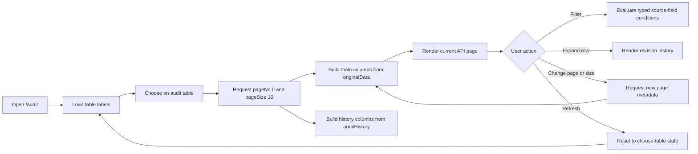

# Audit Frontend

Audit Frontend is an Angular 21 feature for exploring current records and their revision history across tables whose schemas are not identical. A user first chooses an audit table, then the page loads that table's paginated response, creates its columns from JSON, provides source-field filtering, and expands individual rows to show their audit history.

The implementation uses only the dependencies already declared in this project.

## Current capabilities

- Searchable, clearable audit-table selector loaded from `GET /api/v1/allTable`, with a local JSON fallback.
- Empty initial state; records are never fetched before a table is selected.
- Refresh resets the selected table, records, filters, expansion, and pagination.
- API-first table record requests with table-specific JSON fallbacks.
- Main columns generated from originalData.
- Sortable main headers with ascending, descending, and unsorted states.
- Expanded audit-history columns generated independently from auditHistory.
- Current and audit-only record states.
- Typed condition builder with AND/OR matching.
- Consistent accessible Field and Condition listboxes with custom selected states and keyboard navigation.
- Filter fields restricted to ID and displayed source-table columns.
- Text, numeric, date, boolean, empty, and non-empty comparisons.
- Filters applied to the records on the current API page.
- Dynamic pageNo, pageSize, totalElements, totalPages, and navigation controls.
- Keyboard-operable table search with Arrow keys, Enter, and Escape.
- Document titles follow the empty state and selected table.
- Loading, empty, success, and error states.
- Responsive dark audit-console design.
- Unit and interaction tests using Angular's Vitest runner.

## User flow



## Quick start

### Tested environment

- Node.js 22.23.1
- npm 10.9.8
- Angular CLI 21.2.x

### Install and run

```bash
npm ci
npm start
```

Open http://localhost:4200/audit.

### Quality checks

```bash
npm test -- --watch=false
npm run build
```

The current baseline is 25 passing tests and a warning-free production build.

## Routes

| Route             | Purpose                                     |
| ----------------- | ------------------------------------------- |
| /audit            | Primary dynamic audit-table experience      |
| /audit/cards      | Earlier audit-card reference implementation |
| /                 | Redirects to /audit                         |
| Any unknown route | Redirects to /audit                         |

## Feature structure

```text
src/app/features/audit/
├── audit.routes.ts
├── models/
│   ├── audit-record.model.ts
│   ├── audit-table-label.model.ts
│   └── audit-view.model.ts
├── pages/
│   ├── audit-list/
│   └── audit-view/
│       ├── audit-view.ts
│       ├── audit-view.html
│       ├── audit-view.css
│       └── audit-view.spec.ts
└── services/
    ├── audit.service.ts
    └── audit.service.spec.ts

public/data/
├── audit-table-labels.json
├── audit-records.json
├── audit-records-holiday-calendar.json
└── audit-records-loco-singapore.json
```

## JSON source mapping

| Selector label    | Source file                                     | Example records |
| ----------------- | ----------------------------------------------- | --------------: |
| Holiday Calendar  | public/data/audit-records-holiday-calendar.json |               1 |
| Loco Singapore    | public/data/audit-records-loco-singapore.json   |               3 |
| Position Balance  | public/data/audit-records.json                  |               2 |
| Selector fallback | public/data/audit-table-labels.json             |        3 labels |

See [Data contracts](docs/DATA-CONTRACTS.md) for the envelope, field matrix, and rules for adding another table.

## HTTP integration pattern

`AuditService` owns endpoint URLs, typed `HttpClient` calls, paging parameters, fallback behavior, and fixture paging. It returns cold Observables and never subscribes internally. `AuditView` owns request state and subscribes explicitly:

```ts
this.tableLabelsSubscription = this.auditService.getAuditTableLabels().subscribe({
  next: (response) => {
    this.tableLabels = response.data.tableLabels;
    this.areTableLabelsLoading = false;
  },
  error: () => {
    this.tableLabelsErrorMessage = 'Unable to load audit tables.';
    this.areTableLabelsLoading = false;
  },
});
```

The primary selector request is `GET /api/v1/allTable`. The service requests `data/audit-table-labels.json` only if that HTTP request fails. Record methods accept `tableLabel`, `pageNo`, and `pageSize`, request `GET /api/v1/{encodedTableLabel}`, and fall back to the matching JSON fixture if the backend is unavailable. Fixture responses receive consistent paging metadata locally; successful backend responses remain unchanged.

## How dynamic schemas work

The component does not contain a fixed business-record interface. It keeps only the common audit envelope strongly typed:

- Pagination metadata.
- Record identity and originalRecordPresent.
- changeSummary.
- auditHistory metadata such as operation and revision.

Business fields remain a dynamic key/value map. Main-table columns are the ordered union of allowed keys found in originalData. Each expanded record receives its own ordered history-column union after audit metadata is removed.

This separation is intentional: a history-only field can be displayed inside the expanded history table but cannot leak into the main table or Filter Field selector.

## Filtering behavior

Opening Filter records creates one empty condition. Each condition contains:

1. WHERE for the first rule, or an independent AND/OR join for each later rule.
2. A source field.
3. An operator.
4. A value when the operator requires one.

Changing one join never changes another condition. Mixed expressions use standard boolean precedence: AND groups are evaluated before OR groups.

Every source field offers Contains, Equals, Not equals, Starts with, Greater than, Greater than or equal, Less than, Less than or equal, Is empty, and Is not empty. Condition and Value remain usable before field selection, matching the reference workflow; an incomplete rule is ignored until its field and required value are present. Ordered comparisons use numbers when possible, then dates, then case-insensitive natural text ordering.

Incomplete conditions are ignored. Zero complete conditions display all records on the current page.

## Pagination behavior

The service method accepts tableLabel, pageNo, and pageSize and sends pageNo/pageSize as query parameters. The component synchronizes its visible state from every response.

- Selecting a table starts at page 0 and retains the current page size.
- Changing page size returns to page 0.
- First, previous, next, and last buttons calculate a zero-based target page.
- The displayed range is pageNo × pageSize + 1 through the last element on that page, capped by totalElements.

The bundled data files are static fallbacks. The service adapter slices fallback rows and creates consistent page metadata locally so page-size behavior remains functional when the backend is unavailable.

## Adding another audit table

1. Return the label from `GET /api/v1/allTable`.
2. Add the same label to public/data/audit-table-labels.json for offline/demo fallback behavior.
3. Implement `GET /api/v1/{encodedTableLabel}` with pageNo and pageSize query parameters.
4. Add a file named public/data/audit-records-{normalized-label}.json for fallback behavior.
5. Use the common response envelope documented in docs/DATA-CONTRACTS.md.
6. Put current source fields inside originalData.
7. Put revision snapshots inside auditHistory.
8. Run tests and the production build.

The service normalizes labels by lowercasing them and replacing non-alphanumeric groups with hyphens. Position Balance intentionally maps to the original audit-records.json file.

## Dependency policy

No new UI library is required. The feature uses Angular standalone components, HttpClient, Router, RxJS, native HTML controls, Tailwind's global import, globally bundled audit rules isolated with `@scope (app-audit-view)`, and a minimal component host stylesheet.

See [Dependency audit](docs/DEPENDENCIES.md) for installed versions, actual usage, and cleanup recommendations.

## Documentation

- [Product requirements document](docs/PRD.md)
- [Architecture and data flow](docs/ARCHITECTURE.md)
- [UI and interaction specification](docs/UI-UX-SPEC.md)
- [Data contracts and JSON catalog](docs/DATA-CONTRACTS.md)
- [Dependency audit](docs/DEPENDENCIES.md)
- [Reusable implementation prompt](docs/BUILD-PROMPT.md)

## Important implementation files

- src/app/features/audit/pages/audit-view/audit-view.ts
- src/app/features/audit/pages/audit-view/audit-view.html
- src/app/features/audit/pages/audit-view/audit-view.css
- src/app/features/audit/models/audit-view.model.ts
- src/app/features/audit/services/audit.service.ts

## Accessibility

- Native buttons, inputs, and selects are used.
- The table selector exposes combobox/listbox semantics.
- Table options can be searched by API label or visible display name and selected with the keyboard.
- Sort state is exposed through aria-sort on each sortable header.
- Expanded-row buttons expose aria-expanded and record-specific labels.
- Wide history tables use a focusable, record-labelled horizontal scroll region instead of stretching or clipping the records panel.
- Loading and empty states use polite live announcements.
- Request failures use alert semantics.
- Icon-only pagination and removal controls have accessible labels.
- Keyboard focus remains native and visible.
