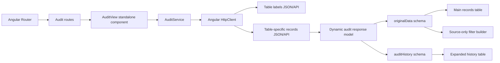
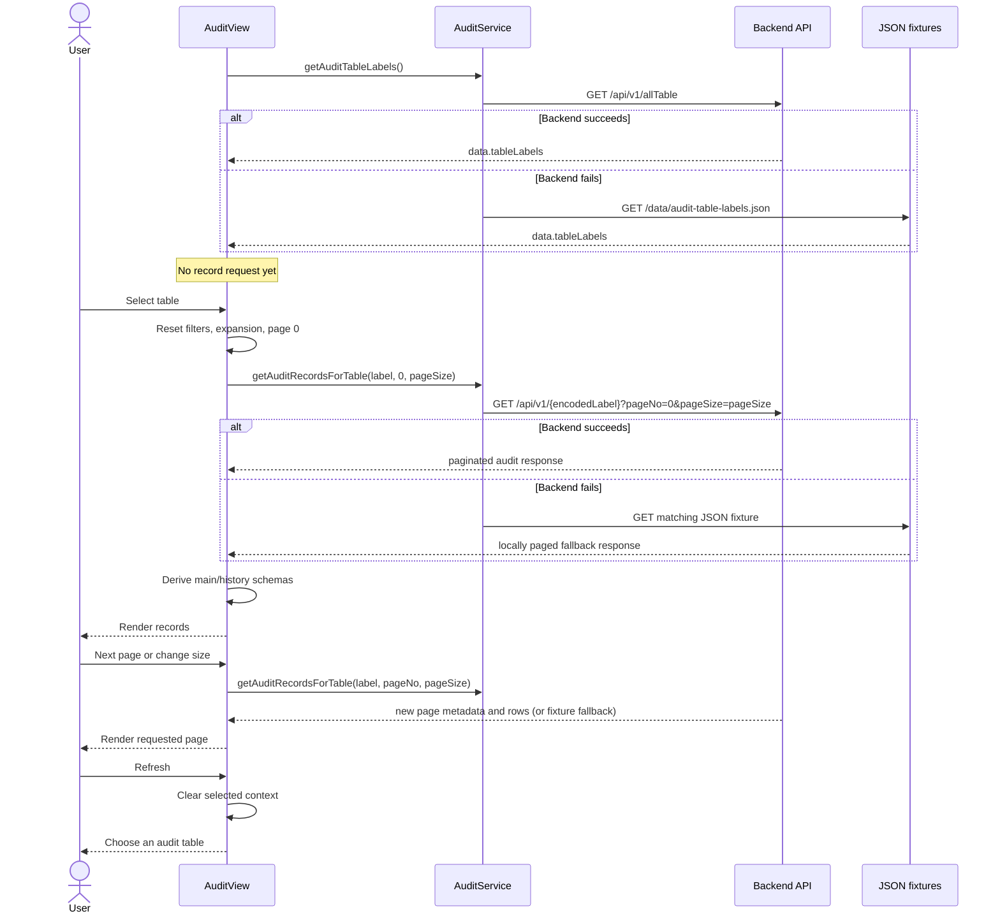
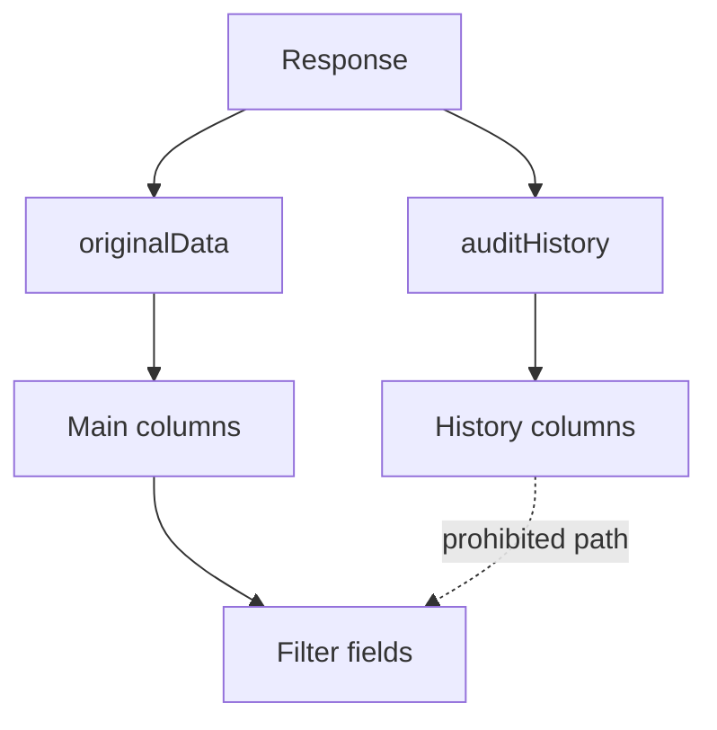
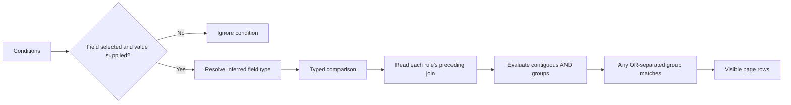

# Architecture

## Overview

The Audit Viewer is a lazy-loaded Angular feature built around one reusable standalone page. It separates transport, common audit metadata, dynamic business fields, presentation schema, and interaction state.



## Responsibilities

### AuditView component

Owns presentation and page interaction state:

- Selected table.
- Table-search text and menu state.
- Records response and derived view rows.
- Main/history presentation columns.
- Filter conditions and their independent AND/OR joins.
- Expanded row IDs.
- Current page and page size.
- Loading and failure messages.

It subscribes explicitly to service Observables, marks the zoneless Angular view for checking after asynchronous success/failure, and unsubscribes from an earlier records request before starting another.

### AuditService

Owns HTTP concerns:

- Labels endpoint.
- Label-to-record-source mapping.
- pageNo and pageSize query parameters.
- Typed Observable return values.

The service does not transform business fields or build columns.

### Models

The models strongly type stable structure and keep unstable business schema generic.

Stable:

- Envelope.
- Pagination.
- Record grouping.
- Change summary.
- Revision metadata.
- Filter and presentation types.

Dynamic:

- originalData fields.
- auditHistory snapshot fields.

### Templates

The template renders:

- Selector/listbox.
- Empty state.
- Response banner.
- Condition builder.
- Dynamic main table.
- Dynamic nested history table.
- Pagination.

The template never needs to know whether the selected entity is a holiday, locomotive, or position balance.

### JSON fixtures

The public data directory acts as the development API. Angular copies these files into the built application so HttpClient can request them from /data.

## Request sequence



## Schema derivation

### Main schema

Input: originalData objects from the current response rows.

Algorithm:

1. Iterate rows in API order.
2. Skip null originalData.
3. Add keys to an insertion-ordered Set.
4. Remove configured technical keys.
5. Humanize labels or apply known label overrides.
6. Infer text, number, date, or boolean type.
7. Map each record to values keyed by the derived schema.

### History schema

Input: every auditHistory entry for the expanded record.

The algorithm is similar, but it uses a different exclusion set. This allows history snapshots to contain extra fields without changing the main table.

### Filter schema

Input: dedicated ID plus derived main columns.

History schema is deliberately not connected to filter schema.



## Filter evaluation

Filtering is client-side and scoped to rows in the current API response.



The first complete rule starts an AND group. A later AND rule extends that group; a later OR rule starts another group. The row is visible when any completed group matches, giving AND standard precedence over OR.

Values are compared as:

- Lowercased strings for text.
- Numbers for numeric fields.
- Normalized calendar-day timestamps for dates.
- Booleans for boolean fields.
- Direct null/empty checks for empty operators.

## Pagination ownership

For a real API, the response is authoritative for:

- pageNo.
- pageSize.
- numberOfElements.
- totalElements.
- totalPages.
- hasPrevious.
- hasNext.

The component calculates only button targets and the visible range. The service treats a successful backend response as authoritative. Its fallback adapter slices static JSON rows and returns consistent page metadata only when the backend request fails.

## State reset boundaries

| Event                   | Filters  | Expansion | Page              | Selection |
| ----------------------- | -------- | --------- | ----------------- | --------- |
| Open/close filter panel | Preserve | Preserve  | Preserve          | Preserve  |
| Page navigation         | Preserve | Clear     | Requested page    | Preserve  |
| Page-size change        | Preserve | Clear     | Reset to 0        | Preserve  |
| Change table            | Clear    | Clear     | Page 0, keep size | Replace   |
| Refresh                 | Clear    | Clear     | Page 0, keep size | Clear     |

## Routing and bundles

The root router lazy-loads audit.routes.ts. The default child route lazy-loads AuditView. The earlier cards route remains separately lazy-loaded.

This keeps the main bundle independent from feature templates and styles until /audit is visited.

## Extension points

### Real backend

`AuditService` already requests the production-style `/api/v1/{encodedTableLabel}` endpoint and falls back to fixtures. Configure the deployment proxy/origin for `/api/v1`; the component and response models remain unchanged.

### Backend schema metadata

For robust pages containing only audit-only rows, extend data with column metadata:

```json
{
  "columns": [
    {
      "key": "LOCOMOTIVE_CODE",
      "label": "Locomotive",
      "type": "text",
      "filterable": true,
      "order": 1
    }
  ]
}
```

The UI can prefer metadata and fall back to response inference.

### Server-side filtering

Serialize complete conditions into a safe request DTO instead of sending arbitrary expressions. The backend should validate field names and operators against its own table schema.

## Technical constraints

- Standalone Angular APIs.
- Explicit RxJS subscription handling.
- No third-party grid or component system.
- Scalar dynamic values only.
- Zero-based page numbers.
- ISO 8601 dates recommended.
- Component CSS controls the feature's visual design.
